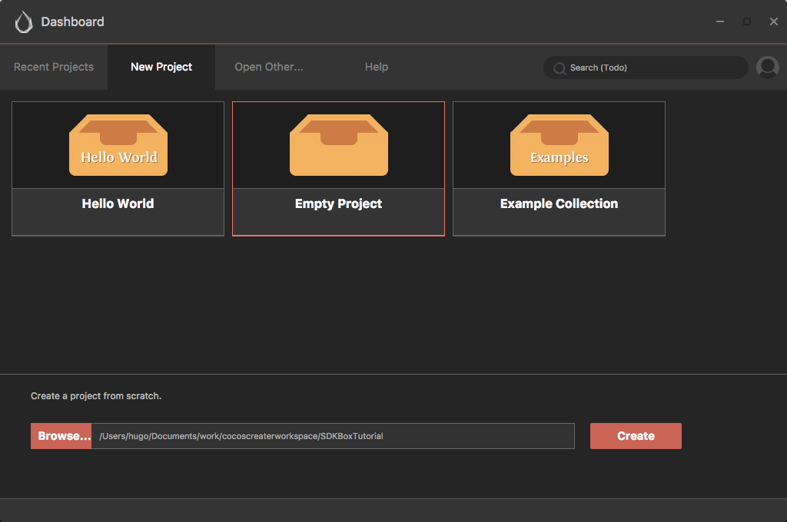
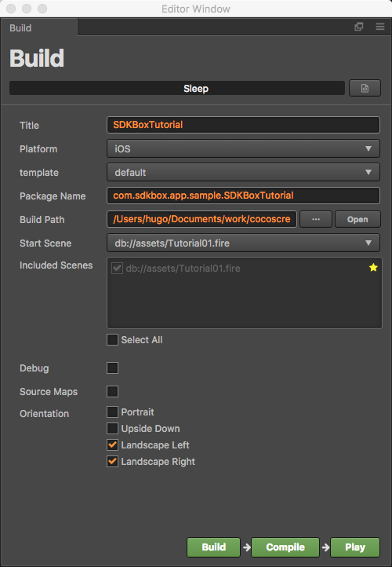
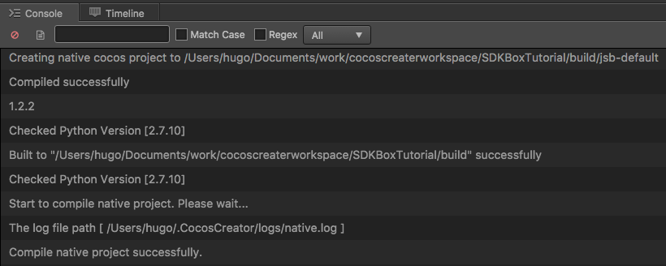
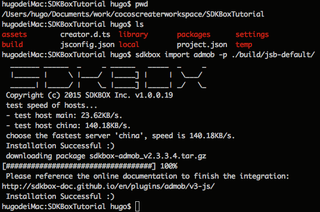

[&#171; SDKBOX Home](http://sdkbox.com)

<h1>在Cocos Creator上使用SDKBox</h1>

## 在 Cocos Creator 工程上集成 SDKBox 插件
---

### 环境

* `CocosCreator` Ver.1.2.2 [安装](http://www.cocos.com/creator)
* `SDKBox Installer` 1.0.0.18 [安装](http://docs.sdkbox.com/en/installer/)

### 创建一个 Cocos Creator 新的空白工程

创建工程 `SDKBoxTutorial` 如下图:


### 添加控件

在场景上添加两个按钮, UI界面可以如下图:


### 创建 JavaScript 的组件

在这个示例中我们会把 `AdMob` 集成到工程中（其它插件的集成流程雷同）, 创建一个 `AdMob.js` 的 javascript 组件. 在这个文件中, 添加三个空函数,如下:

```js
cc.Class({

    ...

    admobInit: function() {
        //finish it after import admob, let it empty for now
    },

    cacheInterstitial: function() {
        //finish it after import admob, let it empty for now
    },

    showInterstitial: function() {
        //finish it after import admob, let it empty for now
    },

    ...

});
```

### 绑定 AdMob.js 到 Canvas

绑定到哪个组件没有强制要求，能尽早初始化就好


### 关联按下事件到 AdMob.js


### 在模拟器中运行

这一步主要是检查工程中的脚本，UI是否都正常

### 编译工程

打开 Cocos Creator 的编译窗口

菜单->工程->编译 或快捷键 (Command + Shift + B)



依次点击
构建->编译



### 安装 AdMob 到 Cocos Creator 工程中

* 打开命令行
* 运行命令 `cd SDKBoxTutorial` 进入到工程根目录
* 运行命令 `sdkbox import admob -p ./build/jsb-default/` 把 admob 集成到 jsb-default 工程中

当然，如果你在构建时选择的工程类型是其它类型，那么工程名字应该是 jsb-xxx



### 配置 AdMob

* 在 `./build/jsb-default/res/sdkbox_config.json` 中填入自己的 AdMob 广告id

`重要提示`: 一定要备份好这个 `sdkbox_config.json` 文件，因为在你每次 `构建` 时，creator 都会把 `./build/jsb-default/res` 目录清空， 再把 creator 编辑器中的资源拷贝到这个文件夹, 所以每次 `构建` 后，`sdkbox_config.json` 都会被删除. 需要手动还原.

### 修改 AdMob.js 中的空函数

在空函数中加入对应的函数调用

对应的 API 文档可以在[这里](http://docs.sdkbox.com/zh/plugins/admob/v3-js/#api-reference)看,就是在 import 成功后，自动打的网页

还可以在这里看 AdMob 的[样例工程](https://github.com/sdkbox/sdkbox-sample-admob)，是 cocos2d-x 工程，用法都是一样的.

```js
cc.Class({

    ...

    admobInit: function() {
        let self = this
        sdkbox.PluginAdMob.setListener({
            adViewDidReceiveAd: function(name) {
                self.showInfo('adViewDidReceiveAd name=' + name);
            },
            adViewDidFailToReceiveAdWithError: function(name, msg) {
                self.showInfo('adViewDidFailToReceiveAdWithError name=' + name + ' msg=' + msg);
            },
            adViewWillPresentScreen: function(name) {
                self.showInfo('adViewWillPresentScreen name=' + name);
            },
            adViewDidDismissScreen: function(name) {
                self.showInfo('adViewDidDismissScreen name=' + name);
            },
            adViewWillDismissScreen: function(name) {
                self.showInfo('adViewWillDismissScreen=' + name);
            },
            adViewWillLeaveApplication: function(name) {
                self.showInfo('adViewWillLeaveApplication=' + name);
            }
        });
        sdkbox.PluginAdMob.init();

        // just for test
        let plugin = sdkbox.PluginAdMob
        if ("undefined" != typeof(plugin.deviceid) && plugin.deviceid.length > 0) {
            this.showInfo('deviceid=' + plugin.deviceid);
            // plugin.setTestDevices(plugin.deviceid);
        }
    },

    cacheInterstitial: function() {
        sdkbox.PluginAdMob.cache('gameover');
    },

    showInterstitial: function() {
        sdkbox.PluginAdMob.show('gameover');
    },

    ...

});
```

### 再次构建编译 Creator 工程

* 备份 `./build/jsb-default/res/sdkbox_config.josn`
* 菜单->工程->编译 或快捷键 (Command + Shift + B)
* 构建->编译
* 这里构建的目的就是让在 AdMob.js 中的修改都同步到 `./build/jsb-default` 工程中
* 将备份好的 `sdkbox_config.json` 恢复到 `./build/jsb-default/res` 中

### 用Xcode来编译运行

* 用Xcode打开 `./build/jsb-default/frameworks/runtime-src/proj.ios_mac/SDKBoxTutorial.xcodeproj`
* 编译 运行


### 重要提示

一定要备份好 `sdkbox_config.json` 文件，每次构建后，`sdkbox_config.json` 文件都会被删除。
