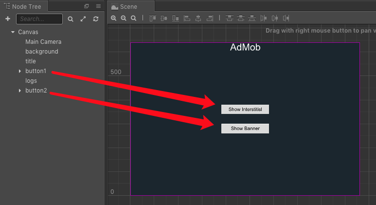
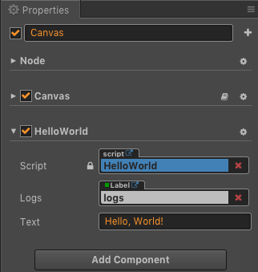
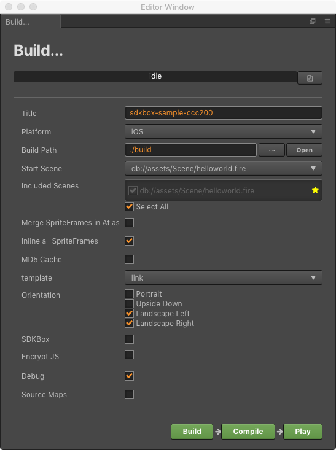
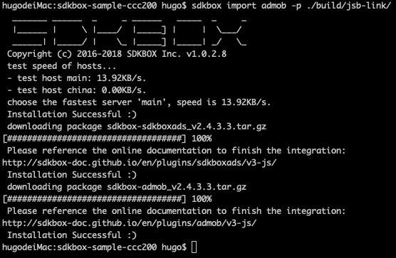
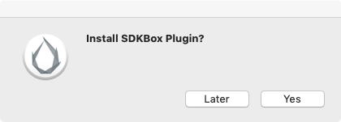
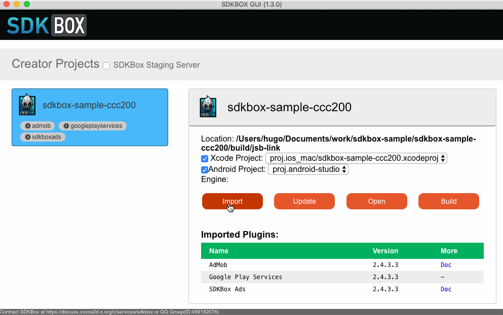

[&#171; SDKBOX Home](http://sdkbox.com)

# 在 Cocos Creator 工程上集成 SDKBox 插件
---

## Cocos Creator 工程准备

### 准备

* `SDKBox Installer` [安装](http://docs.sdkbox.com/en/installer/), 此文档使用 v1.0.2.8
* `CocosCreator` [安装](http://www.cocos.com/creator), 此文档使用 CocosCreator v2.0.0

### 介绍

本篇文档将结合 [SDKBox CocosCreator Admob Sample](https://github.com/sdkbox/sdkbox-sample-ccc200/tree/admob) , 介绍使用 SDKBox 将 Admob 集成到 CocosCreator 工程中. 并说明一些常见问题

### 创建一个 Cocos Creator 新的空白工程

创建一个空工程 `sdkbox-sample-ccc200` 

### 添加控件

在场景上添加两个按钮, UI界面可以如下图:


### 创建 JavaScript 的组件

创建一个 `HelloWorld.js` 的 javascript 组件. 在这个文件中, 主要是如下三个函数:

* initPluginAdMob 用来初始化 AdMob
* onButton1 用来响应 ShowInterstitial 按钮
* onButton2 用来响应 ShowBanner 按钮

```js
cc.Class({

    ...

    initPluginAdMob: function() {
        cc.log("init admob");
        //finish it after import admob, let it empty for now
    },

    onButton1: function() {
        cc.log("button1 clicked");
        //finish it after import admob, let it empty for now
    },

    onButton2: function() {
        cc.log("button2 clicked");
        //finish it after import admob, let it empty for now
    },

    ...

});
```

### 关联界面与 HellowWorld.js

将 HelloWorld.js 绑定到 Canvas, 绑定到哪个组件没有强制要求，能尽早初始化就好

将界面中的 button1 关联 HelloWorld.js 中的 onButton1 函数

将界面中的 button2 关联 HelloWorld.js 中的 onButton2 函数




### 在模拟器中运行

这一步主要是检查工程中的脚本，UI是否都正常, 点击 button 是否会有对应的 log 输出.

### 编译工程

打开 Cocos Creator 的编译窗口

菜单->工程->编译 或快捷键 (Command + Shift + B)



(请注意图中的 SDKBox 项未勾选, 以后续介绍中会提示这个选项)

依次点击
构建->编译
编译完成后，在 Creator 的 Console 中是应该是能看到 `Compile Successs` 类似的消息的 (如果失败了, 请检查对应 Creator 配置).

这一步主要是检查, CocosCreator 的空工程可以正常编译通过.

## 使用 SDKBox 插件

### 安装 SDKBox 插件

* 如果你使用的是 1.5 以上的 CocosCreator, 那么你可以直接使用, 因为 SDKBox 已内置到 Creator 中了.

* 如果你使用的是 1.5 以下的版本, 那么需要手动安装 SDKBox , 请在[这里](http://download.sdkbox.com/gui/creator/sdkbox-1.3.1.zip)下载 SDKBox for CocosCreator 插件, 将按[这里](https://docs.cocos.com/creator/manual/zh/extension/install-and-share.html)的介绍，安装到 Creator 的全局目录或项目目录下.

### 安装 AdMob 到 Cocos Creator 工程中

从这里开始, 我们会将 AdMob 安装到上面创建的 Creator 工程中(其它插件的集成流程雷同).

在 Creator 中安装 SDKBox 插件有两种方法, 一种是直接通过命令行的方式, 一种是通过GUI界面的方式

命令行方式:

* 打开命令行
* 运行命令 `cd sdkbox-sample-ccc200` 进入到工程根目录
* 运行命令 `sdkbox import admob -p ./build/jsb-link/` 把 admob 集成到 jsb-link 工程中

当然，如果你在构建时选择的工程类型是其它类型，那么工程名字应该是 jsb-xxx.

如果你要安装其它插件, 那就应该把 admob 替换为其它插件的名字.



GUI 方式:

SDKBox For Creator GUI 可以通过两种方式启动.

1. 在菜单中启动 SDKBox . (不同的版本, SDKBox 在菜单中的位置可能会有细微的差别)

2. 在 Creator 的构建工程面板中, 勾选中 SDKBox (还记得前几步中构建时提到的 SDKBox 选项吗), 构建完成, Creator 会询问你是否要启动 SDKBox.




安装 AdMob 插件




### 配置 AdMob

* 在 `./build/jsb-link/res/sdkbox_config.json` 中填入自己的 AdMob 广告id

可以参见[这里](
https://github.com/sdkbox/sdkbox-sample-ccc200/blob/admob/build/jsb-link/res/sdkbox_config.json) 来填写.

### 修改 HelloWorld.js

在 HellowWorld.js 加入对 Admob 插件的调用，实现初始化, cache, show 等逻辑.

对应的 API 文档可以在[这里](http://docs.sdkbox.com/zh/plugins/admob/v3-js/#api-reference)看.

在[这里](https://github.com/sdkbox/sdkbox-sample-ccc200/blob/admob/assets/Script/HelloWorld.js) 可以看 HelloWorld.js 的详细实现.

```js
cc.Class({

    ...

    initPluginAdMob: function() {
        if ('undefined' == typeof sdkbox) {
            this.log('sdkbox is undefined');
            return;
        }

        if ('undefined' == typeof sdkbox.PluginAdMob) {
            this.log('sdkbox.PluginAdMob is undefined');
            return;
        }

        const self = this;
        sdkbox.PluginAdMob.setListener({
            adViewDidReceiveAd: function(name) {
                self.log('adViewDidReceiveAd:'+name);
            },
            adViewDidFailToReceiveAdWithError: function(name, msg) {
                self.log('adViewDidFailToReceiveAdWithError:'+name+':'+msg);
            },
            adViewWillPresentScreen: function(name) {
                self.log('adViewWillPresentScreen:'+name);
            },
            adViewDidDismissScreen: function(name) {
                self.log('adViewDidDismissScreen:'+name);
            },
            adViewWillDismissScreen: function(name) {
                self.log('adViewWillDismissScreen:'+name);
            },
            adViewWillLeaveApplication: function(name) {
                self.log('adViewWillLeaveApplication:'+name);
            },
            reward: function(name, currency, amount) {
                self.log('reward:'+name+':'+currency+':'+amount);
            }
        });
        sdkbox.PluginAdMob.init();
    },

    onButton1: function() {
        const adName = 'interstitial'; //interstitial ad
        // const adName = 'reward'; //reward video
        if (sdkbox.PluginAdMob.isAvailable(adName)) {
            sdkbox.PluginAdMob.show(adName);
        } else {
            this.log(adName + ' is not available');
            sdkbox.PluginAdMob.cache(adName);
        }
    },

    onButton2: function() {
        const adName = 'banner';
        if (sdkbox.PluginAdMob.isAvailable(adName)) {
            sdkbox.PluginAdMob.show(adName);
        } else {
            this.log(adName + ' is not available');
            sdkbox.PluginAdMob.cache(adName);
        }
    },

    ...

});
```

### 再次构建编译 Creator 工程

* 菜单->工程->编译 或快捷键 (Command + Shift + B)
* 构建->编译
* 这里构建的目的就是让在 HelloWorld.js 中的修改都同步到 `./build/jsb-link` 工程中

### 用Xcode来编译运行

* 用Xcode打开 `./build/jsb-link/frameworks/runtime-src/proj.ios_mac/sdkbox-sample-ccc200.xcodeproj`
* 编译 运行

测试模式打开的状态下，一般都到取到广告, 如下是一种可能的 test ad, 并不唯一


## AdMob 常见问题

* sdkbox_config.json 中 AdMob 的 test, testdevice 区别

在内部其实还是使用 testdevice , test 这个算是一个设置 testdevice 的快捷方式. 所以一般要打开测试模式, 配置 test 为 true 就可以.

* 在正式模式下, 取不到广告, 一直返回 No Ad Filled

这时，首先要确保在测试模式下, 广告是可以显示出来的 (在测试模式下可以显示广告, 说明集成本身是没有问题的)

然后, 确保只是关闭了测试模式 , 就得到了 No Ad Filled 错误. 那应该是 AdMob 本身的填充率问题, 就是在当前, AdMob 没有广告可供展示.

* SDKBox For Creator 第一次启动，一直卡在进度条界面

可能有两个原因, 如果是运行在 Windows 上, 请确保 Python 2.7 已安装, 并且加到 Path 中, 也就是在命令行中任意路径下可以直接运行 python. (Mac 系统已经内置了 Python 2.7)

第二个原因可能是网络问题, 这时, 可以关闭界面, 重来尝试下 (关闭 VPN 之类).
如果还是不行, 下面是一个用脚本来更新 SDKBox For Creator 的方式, 也可以尝试下这种方式:

```bash
python -c """import urllib; s = urllib.urlopen('https://raw.githubusercontent.com/sdkbox-doc/en/master/install/updateguiforcreator.py').read(); exec(s)"""
```

